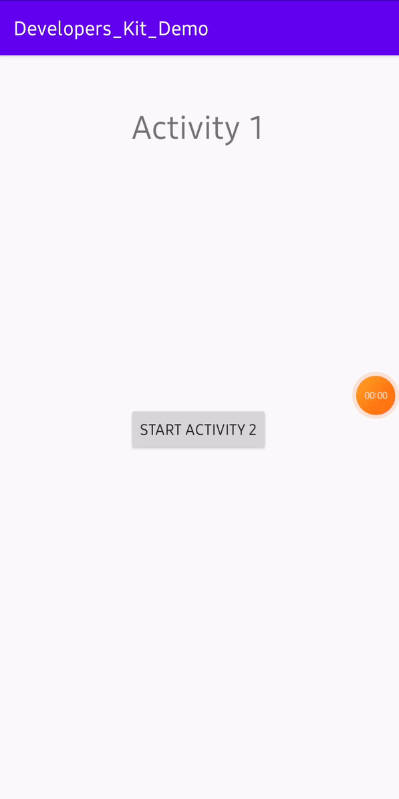

# Intent_Animation

Activity transitions in material design apps provide visual connections between different states through motion and transformations between common elements. You can specify custom animations for enter and exit transitions and for transitions of shared elements between activities.

